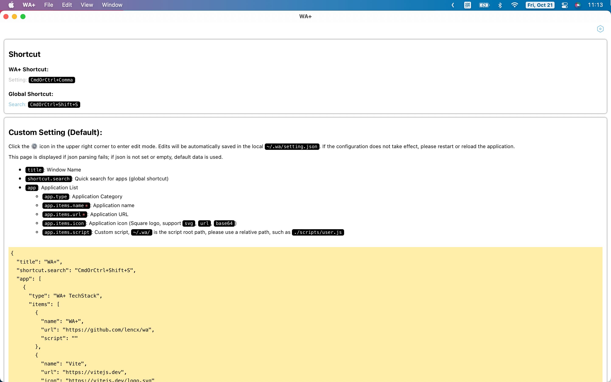
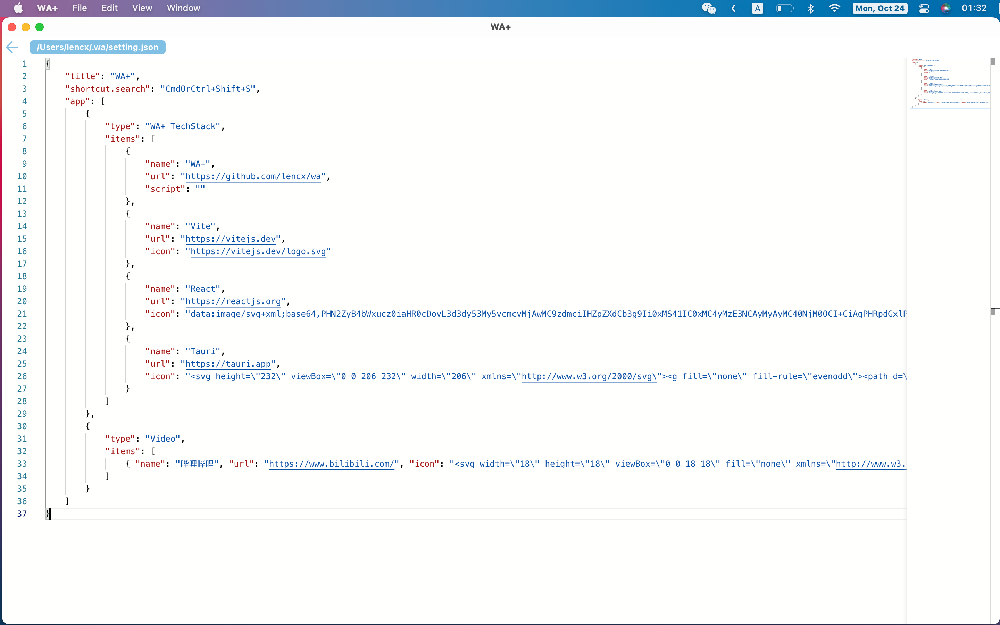
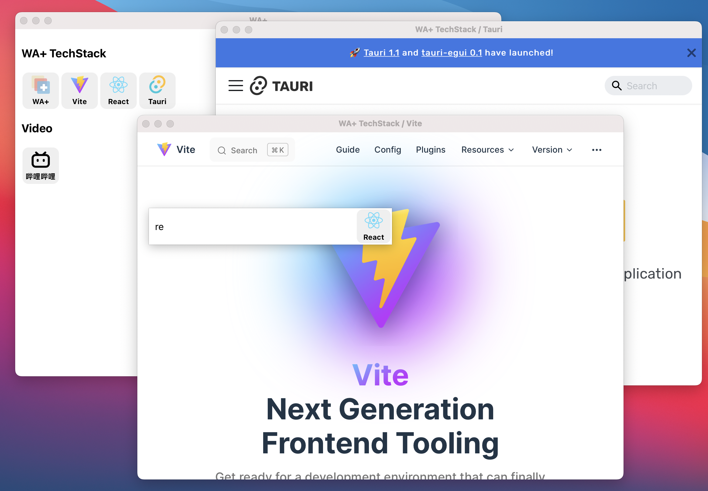
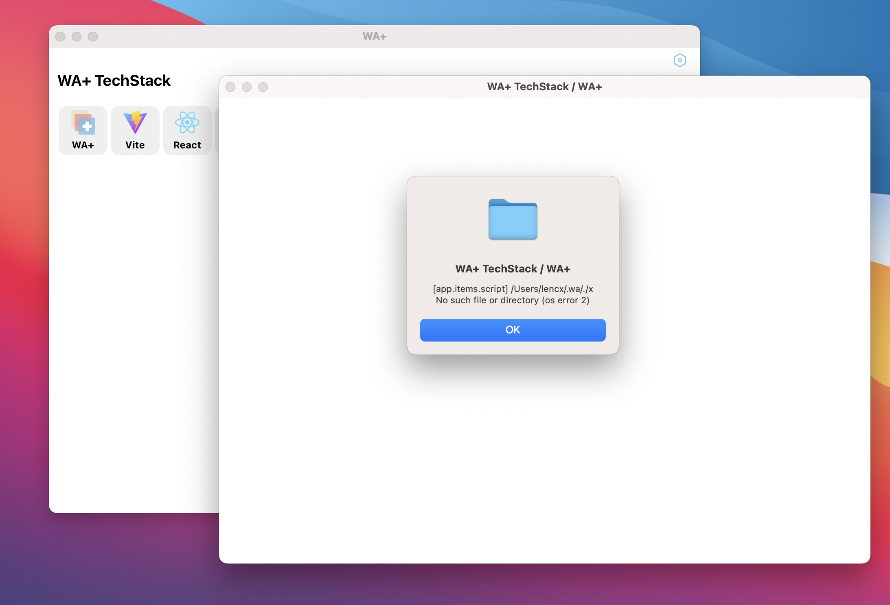
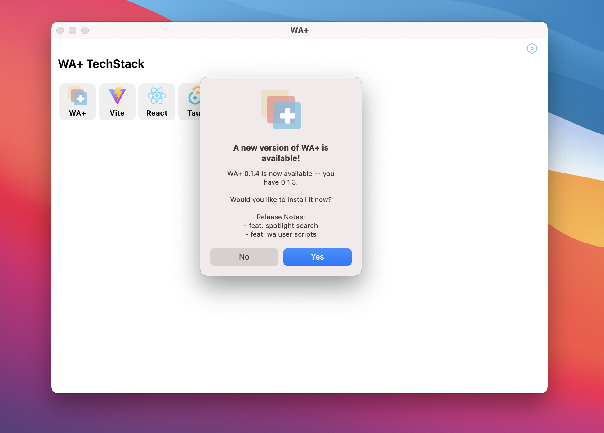
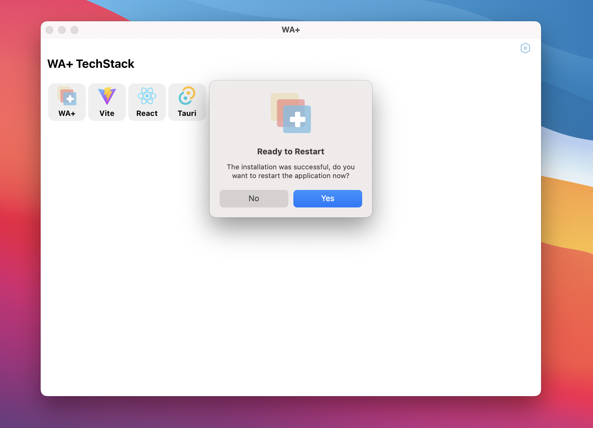

  
  <h2 align="center">WA+</h2>

> WA+ = W(eb) + A(pp) + more...

Make a web page more like a desktop application. Powered by Tauri.

## Install

[📦 Download WA+](https://github.com/lencx/WA/releases)

## Feature

- Multi-platform: `macOS` `Windows` `Linux`
- Configuration via file: `~/.wa/setting.json`
- Custom scripts: `~/.wa/scripts` is the script root path, please use a relative path, such as `./user.js`
- Custom Shortcut
- Spotlight Search
- Check for updates at startup

## Preview

     

## Sponsor

## 关于 WA+

> 关注 《浮之静》公众号，回复 `WA+` 进技术交流群

### 背景

在这个万物互联的时代，信息每天都在爆炸式增长，碎片化严重。资源信息（这里特指网站）如何结构化管理，高效检索也变得越来越重要。浏览器书签具有多端同步功能，使用起来就很方便。甚至 Arc 的出现重新定义了浏览器的交互形式。那为啥还要搞个 WA+ 出来？这个问题我也思考了很久，我认为 WA+ 的最大优势是差异化（浏览器并不具备和操作系统交互的能力，或者说用户很难实现一些自定义扩展）。

### 功能

- 跨多平台：支持的平台有 `MacOS`，`Windows`，`Linux`。
- 配置简单：配置文件采用统一的 JSON 格式数据，支持导出分享。
- 安装包小：因采用 Tauri 来打包应用，使用系统内置的 Webview，所以各平台安装包一般都控制在几兆之内。
- 更加专注：配置的每一个网址都会新开一个应用窗口，防止误操作（没有浏览器的各种按钮，状态栏，搜索框等）。非常适合无客户端类网站。如 Blog，技术文档，视频，在线工具等。
- 聚焦搜索：支持全局快捷键，通过快捷键唤起搜索框，快速检索配置的网址并打开应用窗口。
- 脚本注入：适合有编程经验的用户，对特定网站进行修改。
- 绿色安全：代码完全开源，值得信赖。
- 系统调度：可以和操作系统进行交互，带来无限的想象（计划中）。

### 计划

- 脚本编辑器
- 定制化主题
- 网址拖拽排序
- 配置可视化
- 聚焦搜索结果列表
- 国际化
- 系统托盘
- 系统交互
- ...

## 开发教程

虽然 `Tauri` 已经发布 `v1.0` 版本，但是国内资料少的可怜，我想基于 `Tauri` 开发一款工具集（各种小功能）。并通过写文章的形式来记录开发过程中遇到的各种问题。如果这些文章对你有所帮助，可以 `star` 此项目或者将文章转发给更多有需要的人。大家的支持会给我更大的写作动力，感恩 🙏。

- [GitHub Discussions - Tauri 系列](https://github.com/lencx/OhMyBox/discussions?discussions_q=label%3A%22Tauri+%E7%B3%BB%E5%88%97%22)
- [知乎专栏 - Tauri 系列](https://www.zhihu.com/column/c_1519079232848785408)
- [公众号 - Tauri 系列（免费篇 + 付费篇）](https://mp.weixin.qq.com/mp/appmsgalbum?__biz=MzIzNjE2NTI3NQ==&action=getalbum&album_id=2593843659863752704&from_itemidx=1&from_msgid=2247485485#wechat_redirect) - `探索 Tauri 更多的能力`。免费篇和知乎专栏，GitHub Discussions 是同步更新的。付费内容针对性解决一些问题（涉及 Tauri 源码，解决思路等），不定期更新。原创不易，有能力的朋友可以支持一下，感恩。

## License

GPL-3.0 license © 2022 lencx
